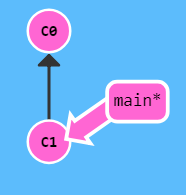
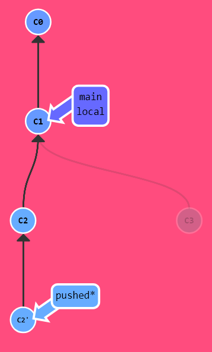
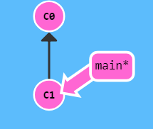
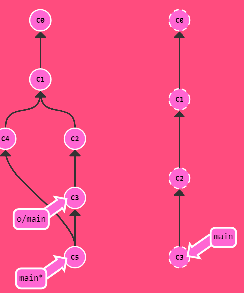

# 基础篇1
|target status|current status|
|----------|---------|
|||
```bash 
git commit -m C2 # 创建节点C2
git commit -m C3 # 创建节点C3
```

# 基础篇2
|target status|current status|
|----------|---------|
|||
```bash 
方案一：
git branch bugFix # 创建分支bugFix
git checkout bugFix # 跳转到bugFix分支上
方案二：
git checkout -b bugFix # 创建并跳转到bugFix分支
```

# 基础篇3
|target status|current status|
|----------|---------|
|||
```bash 
git checkout -b bugFix # 创建并跳转到分支bugFix
git commit -m C2 # 创建节点C2
git checkout main # 跳转到分支main
git commit -m C3 # 创建节点C3
git merge bugFix # 将分支bugFix合并到当前分支（main），并自动创建一个合并节点（C4）（main改变，bugFix没变）
```

# 基础篇4
|target status|current status|
|----------|---------|
|||
```bash 
git checkout -b bugFix # 创建并跳转到bugFix分支
git commit -m C2 # 创建节点C2
git checkout main # 跳转到main分支
git commit -m C3 # 创建节点C3
git checkout bugFix # 跳转到bugFix分支
git rebase main # 从main上提取新的提交记录逐个放到当前分支（bugFix）
```

# 高级篇1
|target status|current status|
|----------|---------|
|||
```bash 
git checkout C4 # 将HEAD跳转到C4
```

# 高级篇2
|target status|current status|
|----------|---------|
|||
```bash 
git checkout bugFix^ # 跳转HEAD到bugFix父节点
```

# 高级篇3
|target status|current status|
|----------|---------|
|||
```bash 
git checkout C1 # 跳转HEAD到节点C1
git branch -f main C6 # 强制移动main分支到C6
git branch -f bugFix C0 # 强制移动bugFix分支到C0
```

# 高级篇4
|target status|current status|
|----------|---------|
|||
```bash 
git reset HEADE~1 # 在本地当前分支撤销一个提交，但是对于大家一起修改的远程分支是无效的。
git checkout pushed # 跳转到pushed分支。
git revert HEAD~1 # 在远程分支撤销一次提交。撤销更改并分享给别人。
```

# 移动提交记录1
|target status|current status|
|----------|---------|
|||
```bash 
git cherry-pick C3 C4 C7 #将一些提交复制到当前分支下（main）
```

# 移动提交记录2
|target status|current status|
|----------|---------|
|||
```bash 
git rebase -i main~4 # 交互式的 rebase, --interactive(-i)，将选择的提交到main的第4父级。
```
> 当 rebase UI界面打开时, 你能做3件事:
. 调整提交记录的顺序（通过鼠标拖放来完成）
. 删除你不想要的提交（通过切换 pick 的状态来完成，关闭就意味着你不想要这个提交记录）
. 合并提交。

# 杂项1
|target status|current status|
|----------|---------|
|||
```bash 
git rebase -i main # 挑选一个C4提交到main分支。
git rebase bugFix main # 将main分支强制转换为bugFix分支上的内容
```

# 杂项2
|target status|current status|
|----------|---------|
|||
```bash 
git rebase -i caption~2 # 将提交重新排序，然后把我们想要修改的提交记录挪到最前。
git commit --amend # 进行一些小的修改。
git rebase -i caption~2 # 将提交顺序调换回来。
git rebase caption main # 将caption分支复制放到main分支
```

# 杂项3
|target status|current status|
|----------|---------|
|||
```bash 
git checkout main # 跳转到main分支
git cherry-pick C2 # 挑选C2到main分支
git commit --amend # 修改提交记录 C2
git cherry-pick C3 # cherry-pick 可以将提交树上任何地方的提交记录取过来追加到 HEAD 上（只要不是 HEAD 上游的提交就没问题）。
```

# 杂项4
|target status|current status|
|----------|---------|
|||
```bash 
git tag v0 C1 # Add tag v0 to C1
git tag v1 C2 # Add tag v1 to C2
git checkout C2 # 跳转到C2节点
```

# 杂项5
|target status|current status|
|----------|---------|
|||
```bash 
git describe bugFix # 离bugFix最近的标签
git commit -m C7 # 创建节点C7
```

# 高级话题1
|target status|current status|
|----------|---------|
|||
```bash 
git rebase main bugFix # 将main分支上的内容复制放到bugFix分支上
git rebase bugFix side #
git rebase side another #
git rebase another main #
```

# 高级话题2
|target status|current status|
|----------|---------|
|||
```bash 
git branch bugwork main~^2~ # 在分支main上的第一父级提交的第二分支的第二父级
```
> 操作符 ^ 与 ~ 符一样，后面也可以跟一个数字。
但是该操作符后面的数字与 ~ 后面的不同，并不是用来指定向上返回几代，而是指定合并提交记录的某个父提交。还记得前面提到过的一个
合并提交有两个父提交吧，所以遇到这样的节点时该选择哪条路径就不是很清晰了。
Git 默认选择合并提交的“第一个”父提交，在操作符 ^ 后跟一个数字可以改变这一默认行为。

# 高级话题3
|target status|current status|
|----------|---------|
|||
```bash 
git checkout one # 跳转到one分支
git cherry-pick C4 C3 C2 # 将C4，C3，C2提交记录复制到分支one上
git checkout two # 跳转到two分支
git cherry-pick C5 C4 C3 C2 # 将C5，C4，C3，C2提交记录复制到分支two上
git branch -f three C2 # 强制移动three分支到C2上
```

# Git远程仓库1
|target status|current status|
|----------|---------|
|||
```bash 
git clone # 本地创建一个远程仓库的拷贝
```

# Git远程仓库2
|target status|current status|
|----------|---------|
|||
```bash 
git commit -m C3 # 创建节点C3
git checkout o/main # 跳转到C1
git commit -m C4 # 创建节点C4
```
> o/main 只有在远程仓库中相应的分支更新了以后才会更新。

# Git远程仓库3
|target status|current status|
|----------|---------|
|||
```bash 
git fetch #
```
> 完成了仅有的但是很重要的两步:
.从远程仓库下载本地仓库中缺失的提交记录
.更新远程分支指针(如 o/main)
git fetch 实际上将本地仓库中的远程分支更新成了远程仓库相应分支最新的状态。
git fetch 并不会改变你本地仓库的状态。它不会更新你的 main 分支，也不会修改你磁盘上的文件。

# Git远程仓库4
|target status|current status|
|----------|---------|
|||
```bash 
git pull # git pull 就是git fetch和git merge 的缩写！
```

# Git远程仓库5
|target status|current status|
|----------|---------|
|||
```bash 
git clone # 本地创建一个远程仓库的拷贝
git fakeTeamwork 2 # 远程仓库做2次提交（fakeTeamwork在真的Git上没有）
git commit -m C4 # 创建节点C4
git pull # 下载远程仓库并merge过来到main
```

# Git远程仓库6
|target status|current status|
|----------|---------|
|||
```bash 
git commit -m C2 # 创建节点C2
git commit -m C3 # 创建节点C3
git push # 提交本地到远程
```

# Git远程仓库7
|target status|current status|
|----------|---------|
|||
```bash 
git clone # 本地创建一个远程仓库的拷贝
git fakeTeamwork # 进行一次远程提交
git commit -m C3 # 进行一次提交
git pull --rebase # 下载远程仓库并rebase到main分支
git push # 推送本地提交到远程仓库
```

# Git远程仓库8
|target status|current status|
|----------|---------|
|||
```bash 
git checkout -b feature # 创建并跳转到分支feature
git push origin feature # 仓选择feature分支提交到远程库
git branch -f main C1 # 强制移动main分支到C1
```

# Git远程仓库的高级操作1
|target status|current status|
|----------|---------|
|||
```bash 
git fetch # 
git rebase C8 side1 # 将C8复制side1分支上
git rebase side1 side2 # 将side1分支复制side2分支上
git rebase side2 side3 # 将side2分支复制side3分支上
git rebase side3 main # 将side3分支复制main分支上
git push origin main # 选择main分支推送到远程仓库
```
>.从远程仓库下载本地仓库中缺失的提交记录
.更新远程分支指针(如 o/main)
git fetch 实际上将本地仓库中的远程分支更新成了远程仓库相应分支最新的状态。
git fetch 并不会改变你本地仓库的状态。它不会更新你的 main 分支，也不会修改你磁盘上的文件。

# Git远程仓库的高级操作2
|target status|current status|
|----------|---------|
|||
```bash 
git checkout main # 跳转到main分支
git pull # git fetch与git merge的缩写
git merge side1 # 将side1分支复制到当前main
git merge side2 # 将side2分支复制到当前main
git merge side3 # 将side3分支复制到当前main
git push # 推送本地提交到远程仓库
```

# Git远程仓库的高级操作3
|target status|current status|
|----------|---------|
|||
```bash 
git checkout -b side o/main # side分支跟踪远程分支o/main
git commit -m C3 # 创建节点C3
git pull --rebase # git fetch与git rebase的缩写
git push # 将本地工作推到远程仓库
```

# Git远程仓库的高级操作4
|target status|current status|
|----------|---------|
|||
```bash 
git push origin main # 指定main分支推送到远程仓库
git push origin foo # 指定foo分支推送到远程仓库
```

# Git远程仓库的高级操作5
|target status|current status|
|----------|---------|
|||
```bash 
git push origin main~:foo # 选定main的第一个分支提交到远程foo分支
git push origin foo:main # 选定foo分支推送到远程main分支
```

# Git远程仓库的高级操作6
|target status|current status|
|----------|---------|
|||
```bash 
git fetch origin main~1:foo # 把远程main的一级父分支的下载到本地foo分支（^与~效果一样）
git fetch origin foo:main # 选择远程分支foo下载到本地main分支
git checkout foo # 跳转到foo分支
git merge main # 将main分支复制到foo
```

# Git远程仓库的高级操作7
|target status|current status|
|----------|---------|
|||
```bash 
git push origin :foo # 提交空的记录到远程，删除了远程foo分支
git fetch origin :bar # 下载空的到本地bar分支（在本地自动创建bar分支）
```

# Git远程仓库的高级操作8
|target status|current status|
|----------|---------|
|||
```bash 
git pull origin bar:foo # git fetch bar:foo与git merge foo的缩写
git pull origin main:side # git fetch main:side与git merge side的缩写
```

